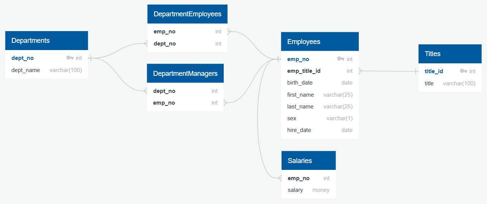

# sql_challenge

## Entity Relationship Diagram:

Some types may be changed in the implementation as development sees a need for change.
## Steps:
### 1:
Please create a database in pgAdmin.
### 2:
Run the 'tables.sql' file in a query tool to create the schema and tables.
### 3:
Import the files from the data folder into the respective tables, the standard settings should be correct.
### 4:
Run the queries in 'queries.sql' to see the results.
